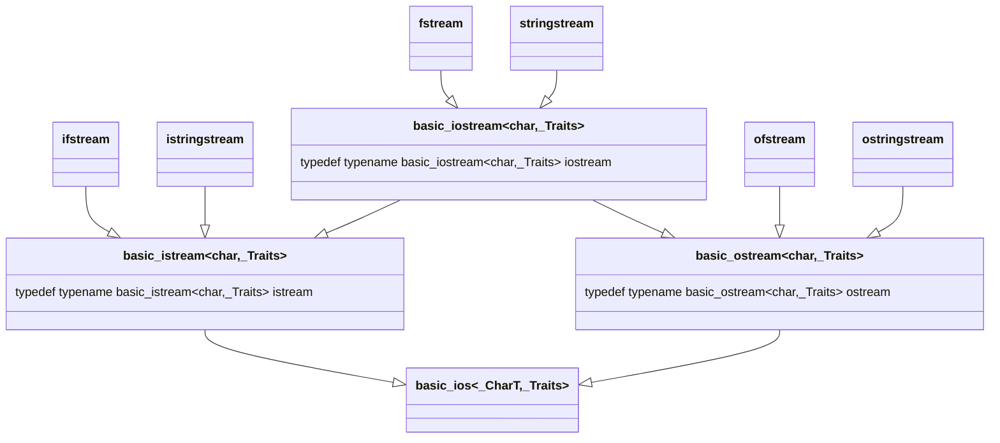

# Fraction分数类库

## 目录

[toc]

## 项目版本

| 版本号  | 版本描述       | 时间      |
| ------- | -------------- | --------- |
| v-1.0.0 | 初步实现分数类 | 2023/2/27 |

## 项目目的

- 构建一个分数类，实现分数的基本运算，同时允许通过使用字符串来构造分数对象，允许字符串和一个分数对象在一起参与运算。


## 项目依赖

- std::istream
- std::ostream
- std::stringstream
- AntonaStandard::WrongArgument_Error

## 相关演示

- 引入头文件，包含命名空间

```cpp
#include "Fraction.h"
using namespace AntonaStandard::AntonaMath;
```


- 由于保留了构造函数的隐式调用，因此对于运算符我们只需要声明定义以下的重载：

```cpp
// 作为友元函数（接收两个外界参数）
Fraction operator+(const Fraction& f1,const Fraction& f2);
Fraction operator-(const Fraction& f1,const Fraction& f2);
Fraction operator*(const Fraction& f1,const Fraction& f2);
Fraction operator/(const Fraction& f1,const Fraction& f2);
bool operator==(const Fraction& f1,const Fraction& f2);
bool operator!=(const Fraction& f1,const Fraction& f2);
bool operator>(const Fraction& f1,const Fraction& f2);
bool operator>=(const Fraction& f1,const Fraction& f2);
bool operator<(const Fraction& f1,const Fraction& f2);
bool operator<=(const Fraction& f1,const Fraction& f2);
std::istream& operator>>(std::istream& input,Fraction& f);
std::ostream& operator<<(std::ostream& output,const Fraction& f);
std::ostream& operator<<(std::ostream& output,const Fraction&& f);

// 作为成员函数（只接受一个或不接受外界参数）
// 负号运算符，将一个分数变成其相反数
Fraction  operator-();
Fraction& operator+=(const Fraction& f);
Fraction& operator-=(const Fraction& f);
Fraction& operator*=(const Fraction& f);
Fraction& operator/=(const Fraction& f);
Fraction& operator=(const Fraction& f);
Fraction& operator=(const Fraction&& f);

```

- 声明的构造函数：

```cpp
Fraction(int num_value, int den_value);
Fraction(int num_value);
Fraction(const char* str);
Fraction();
Fraction(const Fraction& f);
Fraction(Fraction&& f);			// 编译器会进行隐式优化，一般不会调用这个右值构造函数
```

- 因此可以实现，从C-style字符串，整数，其它Fraction对象（左值）与临时Fraction对象（右值），构造Fraction对象
- **构造演示**

```cpp
// 无参构造
Fraction f;						// f == "0/1"
// 单int构造
Fraction f1(10);				// f1 == "10/1"
// 双int构造
Fraction f2(12,3);				// f2 == "12/3"
// 单Fraction左值构造
Fraction f3(f2);				// f3 == "12/3"
// 单Fraction右值购造
Fraction f4(std::move(f3));		// f4 == "12/3"
// 单const char* 构造
Fraction f5("24/5");			// f5 == "24/5"
Fraction f6 = "24/5";			// f6 == "24/5"
```

- **运算演示**

```cpp
Fraction f1 = "23/4";
Fraction f2 = "71/2";
cout<<f1+"1/4"<<endl;					// 6/1
cout<<f2-"1/2"<<endl;					// 35/1
cout<<f1+4<<endl;						// 39/4	
cout<<60-f2<<endl;						// 49/2
cout<<(f1+="1/4")<<endl;				// 6/1
cout<<(f2-="1/2")<<endl;				// 35/1

cout<<(f1==f2)<<endl;					// 0
cout<<(f1>f2)<<endl;					// 0
cout<<(f1>="6")<<endl;					// 1
cout<<(f2<="35/1")<<endl;				// 1
cout<<(f1<18)<<endl;					// 1
cout<<(f2!=35)<<endl;					// 0

Fraction f3 = -1*f1 
cout<<(f3== -f1)<<endl;					// 1
// 输入流运算符
Fraction f4;
cin>>f4;								// 会尝试按照"num/den"的形式读取，如果不存在字符'/'则会终止读取den，并将den赋值为1
cout<<f4;
```

- **相关异常**

```cpp
// 构造异常，主要由以下几个构造函数和运算符触发
/*
Fraction(int num_value, int den_value);
Fraction(const char* str);				// 由operator>>运算符触发
std::istream& operator>>(std::istream& input,Fraction& f);
*/

// 触发条件：如果输入的分母为0则会触发：
// AntonaStandard::WrongArgument_Error
```

- **其它特性**
  - 标准库的流对象继承关系：
  - \_Traits是一个默认模板参数，默认值为一个结构体模板(字符特性模板，这里暂且不做过多的阐述)char_traits 



- 可知 **std::istream** 和 **std::ostream** 的派生类很多，而我们的流运算符都是基于这两个类实现的，因此根据多态的性质基类的指针和引用可以接受派生类的指针与引用，所以我们的流运算符可以使用于任何**std::istream** 和 **std::ostream** 的派生类
- 例如我们的构造函数中就利用到这个特性：

```cpp
// Fraction(const char* str);	源代码
Fraction(const char* str){
    this->denominator = 1;
    std::stringstream inistream;
    inistream<<str;
    inistream>>(*this);    
}
// 输入流运算符源代码：
std::istream& operator>>(std::istream& input,Fraction& f){
    input>>f.numerator;
    char split_c = input.peek();

    if(split_c > '9'||split_c < '0'){
        if(split_c == '/'){
            input>>split_c;
            input>>f.denominator;
            if(f.denominator == 0){
                throw AntonaStandard::WrongArgument_Error("Got 0 in the denominator of AntonaStandard::Math::Fraction object!");
            }
            if(f.denominator<0){
                f.denominator*=-1;
                f.numerator*=-1;
            }
            return input;
        }
    }
    f.denominator = 1;
    return input;
}
```


