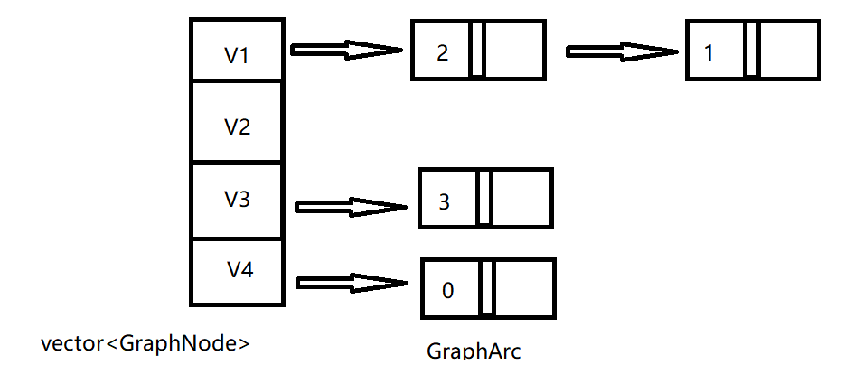

# AutoNode 自动节点类库

## 目录

[toc]

## 项目版本

| 版本号  | 版本描述                                                  | 时间      |
| ------- | --------------------------------------------------------- | --------- |
| v-1.0.0 | - 初步实现自动节点，                                      | 2023/2/19 |
| v-2.0.0 | - 修改邻居的存储方式，添加浅复制（不复制邻居的函数）clone | 2023/2/25 |


## 项目目的

- 常见的**与树和图有关的算法**中可能以及设计模式中的**组合模式**会涉及到链式存储，标准库中的list容器存在局限性，即一个结点没有办法同时连接其它多个结点，因此本项目尝试使用多态来实现可以连接多个结点的结点**接口** 
- 为了其灵活性考虑，本项目尽可能将接口设计地简单，让开发者使用一个公共的框架去**实现树或者图的链式存储** 

## 项目原理

- 使用**原型模式**，其中的克隆（clone）和拷贝（copy）方法允许我们在不知道具体的实例的情况下获取该对象的浅复制和深复制实例。我们的基类是一个抽象类（接口），表示一个结点单元，需要其派生类去实现。每个结点单元中存在一个线性表（**std::map\<type_Key,AutoNode\<type_Key\>\*\>**） ,这意味着任意一个派生自抽象类AutoNode的相同类型键类型的结点单元可以单向连接。 

  

  

## 项目依赖

- AntonaStandard::NotFound_Error 未找到异常
- AntonaStandard:Conflict_Error 冲突异常
- std::map

## 平台（参考）

- Windows10
- VSCode
- GCC 11.2.0 x86_64-w64-mingw32

## 项目结构

- ```mermaid
  classDiagram
  class AutoNode~type_Key~{
  ~Abstract~
  # map~type_Key,AutoNode*~ neighbors
  + abstract AutoNode* clone()
  + abstract AutoNode* copy()
  + virtual AutoNode* remove(const type_Key& k)
  + virtual void add(AutoNode* node_ptr)
  + virtual AutoNode::iterator begin()
  + virtual AutoNode::iterator end()
  + virtual bool empty()
  + virtual size_t size()
  + virtual const type_Key& getKey()
  + virtual AutoNode& operator[](const type_Key& k)
  }
  ```

---


## AntonaStandard相关文件

- **Exception.h** 
- **Exception.cpp** 
- **AutoNode.h**
- **AutoNode.cpp**

## 相关演示

- 由于重写了运算符 **operator[]** 允许开发者快速访问一个结点的邻居结点以及它的邻居的邻居

- 已经重写了虚函数**copy**，它可以以递归的方式自动拷贝所有的邻居，但是前提需要开发者重写**clone**函数，实现叶子结点的拷贝

- **用AutoNode实现树** 

  - ```mermaid
    classDiagram
    class AutoNode~type_Key~{
    ~Abstract~
    # map~type_Key,AutoNode*~ neighbors
    + abstract AutoNode* clone()
    + abstract AutoNode* copy()
    + virtual AutoNode* remove(const type_Key& k)
    + virtual void add(AutoNode* node_ptr)
    + virtual AutoNode::iterator begin()
    + virtual AutoNode::iterator end()
    + virtual bool empty()
    + virtual size_t size()
    + virtual const type_Key& getKey()
    + virtual AutoNode& operator[](const type_Key& k)
    }
    class TreeNode{
    + override TreeNode* copy()
    + override AutoNode* clone()
    }
    TreeNode o--> AutoNode
    
    TreeNode --|> AutoNode:override copy(),clone()
    GreenTreeNode--|>TreeNode:+ override clone()+
    YellowTreeNode--|>TreeNode:+ override clone()
    RedTreeNode--|>TreeNode:+ override clone()
    
    
    ```
    
    
    
  - ```cpp
    #include <iostream>
    #include <queue>
    #include "AutoNode.h"
    using namespace std;
    using namespace AntonaStandard;
    template<typename type_Key>
    class TreeNode:public AutoNode<type_Key>{
    public:
        TreeNode(const type_Key& k){this->key = k;};
        virtual AutoNode<type_Key>* clone()override{
            return new TreeNode(this->key);
        }
        virtual ~TreeNode()override{
            for(auto& i:(*this)){
                delete i.second;
                i.second = nullptr;
            }
        }
    };
    template<typename type_Key>
    class GreenNode:public TreeNode<type_Key>{
    public:
        GreenNode(const type_Key& k):TreeNode<type_Key>::TreeNode(k){};
        virtual AutoNode<type_Key>* clone()override{
            return new GreenNode(this->key);
        }
        void outPutGreenNodeMessage(){
            cout<<" 绿叶: ";
        }
    };
    template<typename type_Key>
    class YellowNode:public TreeNode<type_Key>{
    public:
        YellowNode(const type_Key& k):TreeNode<type_Key>::TreeNode(k){};
        virtual AutoNode<type_Key>* clone()override{
            return new YellowNode(this->key);
        }
        void outPutYellowNodeMessage(){
            cout<<" 黄叶: ";
        }
    };
    template<typename type_Key>
    class RedNode:public TreeNode<type_Key>{
    public:
        RedNode(const type_Key& k):TreeNode<type_Key>::TreeNode(k){};
        virtual AutoNode<type_Key>* clone()override{
            return new RedNode(this->key);
        }
        void outPutRedNodeMessage(){
            cout<<"红叶: ";
        }
    };
    template<typename type_Key>
    void search(AutoNode<type_Key>* root){
        // 广度优先遍历
        queue<AutoNode<type_Key>*> q;
        q.push(root);
        while(!q.empty()){
            for(auto& i:*(q.front())){
                q.push(i.second);
            }
            // 使用dynamic_cast转换来判断实例的类型，然后调用对应的函数
            if(auto p = dynamic_cast<RedNode<type_Key>*>(q.front())){
                p->outPutRedNodeMessage();
            }
            else if(auto p = dynamic_cast<GreenNode<type_Key>*>(q.front())){
                p->outPutGreenNodeMessage();
            }
            else if(auto p = dynamic_cast<YellowNode<type_Key>*>(q.front())){
                p->outPutYellowNodeMessage();
            }
                cout<<q.front()->getKey()<<" ";
                q.pop();
            }
            cout<<endl;
    }
    int main(){
        TreeNode<const char*>* root = new TreeNode<const char*>("Root");
        root->add("A1",new GreenNode<const char*>("A1"));
        root->add("A2",new YellowNode<const char*>("A2"));
        (*root)["A1"].add("B1",new RedNode<const char*>("B1"));
        (*root)["A1"].add("B2",new YellowNode<const char*>("B2"));
        (*root)["A2"].add("B3",new GreenNode<const char*>("B3"));
        (*root)["A2"].add("B4",new RedNode<const char*>("B4"));
        search(root);
        auto r1 = root->copy();
        search(r1);
        auto r2 = (*root)["A1"].copy();
        search(r2);
        delete root;
        delete r1;
        delete r2;
        
        return 0;
    }
    ```
    
  - 

  - 当然，同样适用于图，这里只绘制出邻接链表的组成示意，就不再编写代码了

    - ```mermaid
      classDiagram
      class AutoNode~type_Key~{
      ~Abstract~
      # map~type_Key,AutoNode*~ neighbors
      + abstract AutoNode* clone()
      + abstract AutoNode* copy()
      + virtual AutoNode* remove(const type_Key& k)
      + virtual void add(AutoNode* node_ptr)
      + virtual AutoNode::iterator begin()
      + virtual AutoNode::iterator end()
      + virtual bool empty()
      + virtual size_t size()
      + virtual const type_Key& getKey()
      + virtual AutoNode& operator[](const type_Key& k)
      }
      class GraphNodeBase{
      ~添加deleteNode,实现删除单个结点，保留剩下的结点~
      + void deleteNode(AutoNode*)
      }
      class GraphNode{
      + override clone()
      }
      class GraphArc{
      + int weight
      + override clone()
      }
      GraphNodeBase --|> AutoNode
      GraphNode --|> GraphNodeBase
      GraphArc --|> GraphNodeBase
      
      ```
      
    -   

## 总结

- 刚开始考虑构建像这样的树和图的存储体系会发现非常困难，因为树和图的算法过于灵活了，它们不像顺序表和栈，相关的算法和存储都相对简单。另外我们在使用图和树的时候其链式存储结构还是相当简单的，困难的是它的算法，比如移除，添加，拷贝等。其中最麻烦的算法是遍历，图和树的链式存储办法的遍历方式是不同的。
- 因此我们的项目目的在于，构建一个方便拓展，多态存储，维护方便（删除，插入，拷贝）的链式存储体系