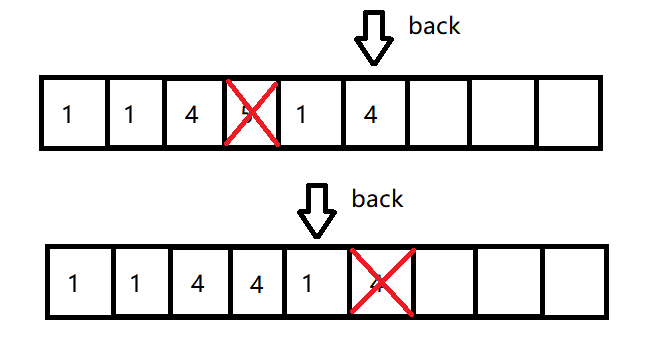

# AutoNode 自动节点类库

## 目录

[toc]

## 项目版本

| 版本号  | 版本描述             | 时间      |
| ------- | -------------------- | --------- |
| v-1.0.0 | - 初步实现自动节点， | 2023/2/19 |


## 项目目的

- 常见的**与树和图有关的算法**中可能以及设计模式中的**组合模式**会涉及到链式存储，标准库中的list容器存在局限性，即一个结点没有办法同时连接其它多个结点，因此本项目尝试使用多态来实现可以连接多个结点的结点**接口** 
- 为了其灵活性考虑，本项目尽可能将接口设计地简单，让开发者使用一个公共的框架去**实现树或者图的链式存储** 

## 项目原理

- 使用**原型模式**，其中的克隆（clone）方法可以获取当前派生类型的this指针（通过返回值协变进行类型转换）。也就是说通过clone()方法就可以访问派生类新增的方法。
- 我们的基类是一个抽象类（接口），表示一个结点单元，需要其派生类去实现。每个结点单元中存在一个线性表（**std::vector\<AutoNode*\>**） ,这意味着任意一个派生自抽象类AutoNode的结点单元都可以相互连接。选择vector存储的原因是遍历速度非常快，同时为了降低删除结点的时间复杂度，我们采用的是**覆盖式的删除办法**，即要删除某个结点时需要用末尾的元素覆盖它然后将vectord的末尾弹出。删除掉一个结点不会影响剩下结点的遍历，但是顺序会改变
  -   
  - 添加结点时不会考察是否重复，这意味着两个结点之间可能有多个连接
- 实现起来足够简单，因此其可扩展性较高

## 项目依赖

- AntonaStandard::NotFound_Error 未找到异常
- std::overflow_error
- std::vector\<AutoNode*\> 

## 平台（参考）

- Windows10
- VSCode
- GCC 11.2.0 x86_64-w64-mingw32

## 项目结构

- ```mermaid
  classDiagram
  class AutoNode{
  ~Abstract~
  # vector~AutoNode*~ neighbors
  + abstract AutoNode* copy()
  + virtual AutoNode* remove(size_t index)
  + virtual void remove(AutoNode& node)
  + virtual void add(AutoNode* node_ptr)
  }
  ```

---


## AntonaStandard相关文件

- **Exception.h** 
- **Exception.cpp** 
- **AutoNode.h**
- **AutoNode.cpp**

## 相关演示

- 由于重写了运算符 **operator[]** 允许开发者快速访问一个结点的邻居结点以及它的邻居的邻居

- **用AutoNode实现树** 

  - ```cpp
    #include <iostream>
    #include <string>
    #include "AutoNode.h"
    #include <queue>
    using namespace std;
    using namespace AntonaStandard;
    class TreeNode:public AutoNode{
    private:
        string name;
    public:
        inline string& getName(){
            return this->name;
        }
        virtual TreeNode* copy()override{
            if(this->empty()){
                // 递归出口，如果是叶子结点，则不需要继续向下构造
                return new TreeNode(this->name);
            }
            TreeNode* ret_ptr = new TreeNode(this->name);
    
            for(auto& i:*this){
                // 递归式拷贝
                ret_ptr->add(i->copy());
            }
            return ret_ptr;
        }
        explicit TreeNode(string n):name(n){};
        virtual ~TreeNode(){
            for(auto& i:*this){
                delete i;
                i = nullptr;
            }
            cout<<this->getName()<<"删除完毕"<<endl;
        }
    };
    void print_tree(TreeNode* root,queue<AutoNode*>& queue){
        // 广度优先遍历
        queue.push(root);
        while(queue.size()){
            // 将队列首节点中所有的子节点都放到队列中
            for(auto i:(*queue.front())){
                queue.push(i);
            }
            cout<<static_cast<TreeNode*>(queue.front())->getName()<< " ";
            queue.pop();
        }
        cout<<endl;
    }
    
    int main(){
     
        queue<AutoNode*> q;
        TreeNode* A = new TreeNode("A");
        AutoNode::iterator iter = A->begin();
        
        A->add(new TreeNode("B1"));
        A->add(new TreeNode("B2"));
        
        (*A)[0].add(new TreeNode("C1"));
        (*A)[0].add(new TreeNode("C2"));
    
        (*A)[0].add(new TreeNode("C3"));
        (*A)[0].add(new TreeNode("C4"));
    
        (*A)[0][0].add(new TreeNode("D1"));
        
       
        print_tree(A,q);
        cout<<endl;
        AutoNode* a = (*A)[0].remove(0);
        delete a;
        
        print_tree(A,q);
        delete A;
    }
    /*输出
    A B1 B2 C1 C2 C3 C4 D1 
    
    D1删除完毕
    C1删除完毕
    A B1 B2 C4 C2 C3
    C4删除完毕
    C2删除完毕
    C3删除完毕
    B1删除完毕
    B2删除完毕
    A删除完毕
    
    */
    ```

- 也可以实现具有多态属性的树

  - ```mermaid
    classDiagram
    class AutoNode{
    ~Abstract~
    # vector~AutoNode*~ neighbors
    + abstract AutoNode* copy()
    + virtual AutoNode* remove(size_t index)
    + virtual void remove(AutoNode& node)
    + virtual void add(AutoNode* node_ptr)
    }
    class TreeNode{
    + override TreeNode* copy()
    + virtual string getName()
    }
    TreeNode o--> AutoNode
    
    TreeNode --|> AutoNode:+ virtual string getName()
    GreenTreeNode--|>TreeNode:+ override string getName()
    YellowTreeNode--|>TreeNode:+ override string getName()
    RedTreeNode--|>TreeNode:+ override string getName()
    
    
    ```

    

  - ```cpp
    #include <iostream>
    #include <string>
    #include "AutoNode.h"
    #include <queue>
    using namespace std;
    using namespace AntonaStandard;
    class TreeNode:public AutoNode{
    private:
        string name;
    public:
        inline virtual string getName(){
            return this->name;
        }
        virtual TreeNode* copy()override{
            if(this->empty()){
                // 递归出口，如果是叶子结点，则不需要继续向下构造
                return new TreeNode(this->name);
            }
            TreeNode* ret_ptr = new TreeNode(this->name);
    
            for(auto& i:*this){
                // 递归式拷贝
                ret_ptr->add(i->copy());
            }
            return ret_ptr;
        }
        explicit TreeNode(string n):name(n){};
        virtual ~TreeNode(){
            for(auto& i:*this){
                delete i;
                i = nullptr;
            }
            cout<<this->getName()<<"删除完毕"<<endl;
        }
    };
    class GreenTreeNode:public TreeNode{
    public:
        explicit GreenTreeNode(string n):TreeNode(n){};
        virtual string getName()override{
            string n = "绿叶 " + this->TreeNode::getName();
            return n;
        }
    };
    class YellowTreeNode:public TreeNode{
    public:
        explicit YellowTreeNode(string n):TreeNode(n){};
        virtual string getName()override{
            string n = "黄叶 " + this->TreeNode::getName();
            return n;
        }
    };
    class RedTreeNode:public TreeNode{
    public:
        explicit RedTreeNode(string n):TreeNode(n){};
        virtual string getName()override{
            string n = "红叶 " + this->TreeNode::getName();
            return n;
        }
    };
    void print_tree(TreeNode* root,queue<AutoNode*>& queue){
        queue.push(root);
        while(queue.size()){
            // 将队列首节点中所有的子节点都放到队列中
            for(auto i:(*queue.front())){
                queue.push(i);
            }
            cout<<static_cast<TreeNode*>(queue.front())->getName()<< " ";
            queue.pop();
        }
        cout<<endl;
    }
    
    int main(){
     
        queue<AutoNode*> q;
        TreeNode* A = new TreeNode("Root A");
        AutoNode::iterator iter = A->begin();
        
        A->add(new GreenTreeNode("B1"));
        A->add(new YellowTreeNode("B2"));
        
        (*A)[0].add(new RedTreeNode("C1"));
        (*A)[0].add(new RedTreeNode("C2"));
    
        (*A)[0].add(new YellowTreeNode("C3"));
        (*A)[0].add(new GreenTreeNode("C4"));
    
        (*A)[0][0].add(new YellowTreeNode("D1"));
        
       
        print_tree(A,q);
        cout<<endl;
        AutoNode* a = (*A)[0].remove(0);
        delete a;
        
        print_tree(A,q);
        delete A;
    }
    ```

  - 当然，同样适用于图，这里只绘制出邻接链表的组成示意，就不再编写代码了

    - ```mermaid
      classDiagram
      class AutoNode{
      ~Abstract~
      # vector~AutoNode*~ neighbors
      + abstract AutoNode* copy()
      + virtual AutoNode* remove(size_t index)
      + virtual void remove(AutoNode& node)
      + virtual void add(AutoNode* node_ptr)
      }
      class GraphNodeBase{
      ~添加deleteNode,实现删除单个结点，保留剩下的结点~
      + void deleteNode(AutoNode*)
      }
      class GraphNode{
      + string name
      }
      class GraphArc{
      + int index
      }
      GraphNodeBase --|> AutoNode
      GraphNode --|> GraphNodeBase
      GraphArc --|> GraphNodeBase
      
      ```

    -  