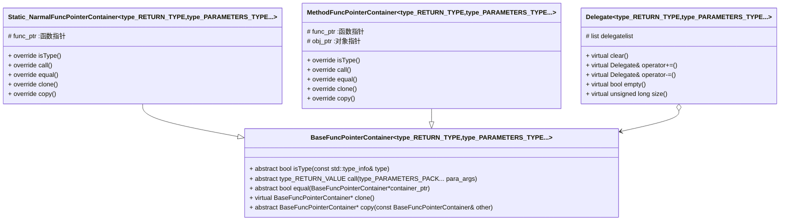

# Delegate事件委托类库

## 目录

[toc]

## 项目版本

| 版本号  | 版本描述                                                     | 时间       |
| ------- | ------------------------------------------------------------ | ---------- |
| v-1.0.0 | 完成事件委托基本功能可以满足多参数函数的委托                 | 2022/12/29 |
| v-1.0.1 | 修改createNew和getSelf的命名为copy和clone使之更加满足原型模式的命名<br />修复删除委托(-=)中未找到目标时传入的参数内存泄漏的问题 | 2022/12/30 |
| v-1.1.0 | - 参考了包装器是他的::function的模板写法，解决了原来Delegate<void,void>增加无返回值无参数类型（void(void)）型报错的问题，现在正确的写法是Delegate<void()>或Delegate<void(void)><br />\- 添加了copy的无参数构造版本,修改了左值引用复制构造函数和左值引用赋值运算符的函数体<br />\- 标准库std::function与我们的BaseFuncPointerContainer实现办法类似，暂时不考虑用std::function替换我们的架构 | 2023/1/1   |
| v-2.0.0 | -通过std::remove_reference实现了将引用转化成值类型的,使得返回值为引用类型的函数的返回值得以保存<br />-添加了事件委托Delegate的返回值type具体化版本，使得返回值为void的事件委托不返回线性表<br />\- 由于返回值存到线性表中有时间成本，为返回值非void的事件委托添加了call_without_return接口，以无返回值的形式调用 | 2023/1/1   |


## 项目目的

- 实现类似C#中的事件委托机制，设置一个可以绑定多个函数同时执行的类或函数（单线程内）
- 参考链接：[(二)_YzlCoder的博客-CSDN博客_c++委托模式](https://blog.csdn.net/y1196645376/article/details/51416043)  
- 详细的介绍也可以看看我的博客
  - [【项目三】C++实现事件委托_学艺不精的Антон的博客-CSDN博客](https://blog.csdn.net/yyy11280335/article/details/128488238?spm=1001.2014.3001.5501) 
  - [(1条消息) 【项目三 （利用remove_reference将引用类型转化为值类型，从而实现对任何非void类型函数的返回值存储）】C++实现事件委托（完全体）_学艺不精的Антон的博客-CSDN博客](https://blog.csdn.net/yyy11280335/article/details/128515629?csdn_share_tail={"type"%3A"blog"%2C"rType"%3A"article"%2C"rId"%3A"128515629"%2C"source"%3A"yyy11280335"}) 


## 项目原理

- 使用多态和函数指针，分别封装普通函数，静态函数（普通函数和静态函数的函数指针属性相同，可以共用一个封装类）和成员函数的函数指针，最后通过Delegate类多态存储不同类型的指针
  - 为了能删除对应的函数指针，应当添加一个比较接口
- 通过可变模板参数可以实现多参数的函数的委托
- 利用**原型模式**，使得函数指针容器的复制不受具体类型的限制
- 使用模板结构体remove_reference,通过不同的具体化将引用类型转化成值类型，使得对函数返回值的存储成为可能

## 项目依赖

- C++11标准
- AntonaStandard::NotFound_Error （#include "Exception.h"） 
- std::type_info
- std::vector
- std::list

## 平台（参考）

- Windows10
- VSCode
- GCC 11.2.0 x86_64-w64-mingw32

## 项目结构

- 我用abstract表示纯虚函数，用virtual 表示一般的虚函数，override表示重写



---

## AntonaStandard相关文件

| 文件名      | 内容               |
| ----------- | ------------------ |
| Exception.h | 常用异常类         |
| Delegate.h  | 事件委托的泛型实现 |

## 相关演示

- 首先声明定义几个类

```cpp
class A{
public:
    static int s_i_v_A(){
        cout<<"int返回值无参数A的静态函数"<<endl;
        return 10;
    }
    int i_v_A(){
        cout<<"int返回值无参数A的非静态函数"<<endl;
        return 11;
    }

};
int i_v(){
    cout<<"int返回值无参数普通函数"<<endl;
    return 12;
}
class B{
public:
    static void s_v_v_B(){
        cout<<"无返回值无参数B的静态函数"<<endl;
    }
    void v_v_B(){
        cout<<"无返回值无参数B的非静态函数"<<endl;
    }
};
void v_v(){
    cout<<"无返回值无参数的普通函数"<<endl;
}

class C{
public:
    static int& s_iq_iq_C(int& v){
        cout<<"无返回值无参数C的静态函数 "<<v<<endl;
        return v;
    }
    int& iq_iq_C(int& v){
        cout<<"无返回值无参数C的非静态函数 "<<v<<endl;
        return v;
    }
};
int& iq_iq(int& v){
    cout<<"无返回值无参数的普通函数 "<<v<<endl;
    return v;
}
```

- 实例化上面声明定义的类

```cpp
A a;
B b;
c c;
```

- 实例化相应的委托类

```cpp
Delegate<int(void)> del;
Delegate<void()> del1;
Delegate<int&(int&)> del2;
```

- 添加委托

```cpp
del += newDelegate(A::s_i_v_A);
del += newDelegate(a,a.i_v_A);
del += newDelegate(i_v);

del1 += newDelegate(B::s_v_v_B);
del1 += newDelegate(b,b.v_v_B);
del1 += newDelegate(v_v);

del2 += newDelegate(C::s_iq_iq_C);
del2 += newDelegate(c,c.iq_iq_C);
del2 += newDelegate(iq_iq);
```

- 调用委托

```cpp
vector<int> vec = del();			// 返回值为int，无参数列表调用演示
cout<<"--------------"<<endl;
del.call_without_return();			// 无返回值调用办法
for(int i = 0;i<vec.size();++i){
    cout<<vec[i]<<" ";				// 查看保存的返回值
}
cout<<endl<<"--------------"<<endl;
del1();								// 无返回值，无参数调用演示
cout<<endl<<"--------------"<<endl;
int x = 666;
vector<int> vec2 = del2(x);			// 返回值为int,int&参数调用演示
for(int i = 0;i<vec2.size();++i){
    cout<<vec2[i]<<" ";
}
```

- 输出

```cpp
int返回值无参数A的静态函数
int返回值无参数A的非静态函数
int返回值无参数普通函数
--------------
int返回值无参数A的静态函数
int返回值无参数A的非静态函数
int返回值无参数普通函数
10 11 12
--------------
无返回值无参数B的静态函数
无返回值无参数B的非静态函数
无返回值无参数的普通函数

--------------
无返回值无参数C的静态函数 666
无返回值无参数C的非静态函数 666
无返回值无参数的普通函数 666
666 666 666
```

