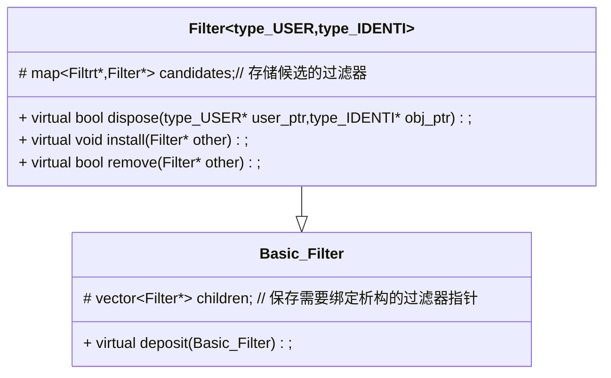

# 运行时类型识别和处理库——过滤器 Filter


## 目录

[toc]


## 前言


- C++动态类型识别是一个比较头疼的问题，一个基类指针保存了一个子类对象，需要识别子类对象，对其进行一定的操作。我之前的想法是获取到这个子类对象的类型具体名称，这样就可以知道有那些可以调用的成员。之前的想法是在基类中添加一个虚函数，这个虚函数的返回值是基类指针，然后每派生一个类就**重写** 这个虚函数，令其返回值协变成派生类指针。之前在[踩坑日志](https://blog.csdn.net/yyy11280335/article/details/129637305?spm=1001.2014.3001.5501)内提到了，当返回值为基类或派生类指针，其返回值会自动转化为调用处的数据类型，比如通过基类指针调用，那么返回值是基类指针，用派生类指针调用，返回值是派生类。
- 直到前一段时间研究Qt的事件处理机制时，Qt的事件过滤器给了我灵感，我们进行**运行时类型识别 RTTI** 时的最主要的关注点其实是如何去处理它，而不是进行类型转化（不是把基类指针转化成对应的派生类指针），Qt 处理事件的时候，需要识别基类事件指针 **QEvent\*** 具体保存的对象，然后针对具体的对象进行对应的操作。Qt的每一个从元类 **QObject** 派生的类都拥有一个虚函数，**event** 这个虚函数可以默认处理一些常见的事件对象，而如果需要处理一些特殊的，不常见的以及我们自己派生出来的事件时，就需要给这个对象安装一个**事件过滤器QEventFilter** ,在虚函数 **event** 内部会调用这个事件过滤器，优先处理特殊的事件对象。

## 项目版本

| 版本号  | 版本描述                                                     | 时间      |
| ------- | ------------------------------------------------------------ | --------- |
| v-1.0.0 | 初步实现过滤器                                               | 2023/3/31 |
| v-1.1.0 | 为了防止与标准库Filter.h重名，修改头文件名称为 TypeFilter.h  | 2023/7/8  |
| v-1.2.0 | 修改命名空间从 `AntonaStandard` 到 `AntonaStandard::Utilities` | 2023/8/8  |


## 项目原理

- 使用C++的关键字 typeid确定真实的对象类型。

- 定义一个过滤器模板虚基类 **Filter** ,它的模板表示**需要动态类型识别的基类类型 和 需要反馈的对象类型** 和内部通过虚函数接口**dispose** ，该虚函数返回 **bool** 类型变量，表示传入的基类指针的对象已经被处理，后续将不会调用其它过滤器处理这个基类指针。

- 需要接收 **使用过滤器的对象指针，（调用者的指针）** 的原因是：

  - > 过滤器处理完了基类指针可能需要向调用者进行反馈

- 项目使用到的设计模式属于 **策略模式** 

- 可以看到，过滤器是和其调用者**高度耦合**的，使用的时候必须对应使用

## 项目依赖

- std::vector
- std::map
- AntonaStandard::Exception

## 构建平台

- C++ 11
- Windows10 ,Linux Ubuntu 22.04
- VSCode
- GCC 11.2.0 x86_64-w64-mingw32, GCC 11.3.0 x86_64-linux-gnu

## 项目结构



- 结构非常简单，其使用流程如下：

  ```mermaid
  graph TB
  Derived(根据调用处的类型和需要处理的对象类型派生具体的过滤器)-->
  Install(需要扩展时同理派生同种过滤器调用install进行安装)-->
  Dispose(调用dispose对传入的指针进行处理处理不了则调用候选过滤器)
  Remove(通过调用remove移除某个过滤器)
  
  ```
  

## 类型说明

### Basic_Filter

- 实现所有派生自它的过滤器对象的内存管理，凡是将parent指针设置为它的子类对象都将在，这个被设置的对象生命周期结束时自动析构，省去了内存管理的功夫。

### Filter

- 是一个模板类，用于实现过滤器之间的安装，移除和处理多态派生体系，使用时可以选择派生该过滤器对象或者为其安装其它派生自它的过滤器对象来实现运行时类型识别和处理。

## 成员函数 

#### Basic_Filter::BasicFilter

- 函数原型如下：

  - > `inline AntonaStandard::Basic_Filter::`
    >
    > `Basic_Filter(AntonaStandard::Basic_Filter *parent_)` 

- 作用：

  - 用于指定父对象，实现内存托管。如果父对象析构，其下的所有子对象也将自动析构

#### Basic_Filter::deposit

- 函数原型如下:

  - > `inline virtual void AntonaStandard::Basic_Filter::`
    >
    > `deposit(AntonaStandard::Basic_Filter *child)` 

- 作用：
  - 由构造函数内部调用，用于添加被托管的子对象。

#### **Filter::Filter** 

- 函数原型如下

  - > `template<class type_USER, class type_IDENTI> `
    >
    > `inline AntonaStandard::Filter<type_USER, type_IDENTI>::`
    >
    > `Filter(AntonaStandard::Basic_Filter *p = nullptr)`  

- 作用：

  - 构造过滤器，是Basic_Filter::BasicFilter 的重载

  

#### Filter::install 

- 函数原型如下

  - > `template<class type_USER, class type_IDENTI> `
    >
    > `virtual void AntonaStandard::Filter<type_USER, type_IDENTI>::`
    >
    > `install(AntonaStandard::Filter<type_USER, type_IDENTI> *other)` 

- 作用：

  - 当需要扩展一个已有的过滤器的识别功能时，可以通过为其安装其它的同一种基类型的过滤器(**Filter<type_USER,type_IDENTI>**) ，这样在该过滤器调用函数dispose时就会调用这个安装的过滤器以实现扩展功能。

#### Filter::remove

- 函数原型如下：

  - > `template<class type_USER, class type_IDENTI> `
    >
    > `virtual bool AntonaStandard::Filter<type_USER, type_IDENTI>::`
    >
    > `remove(AntonaStandard::Filter<type_USER, type_IDENTI> *other)` 

- 作用：

  - 用于移除传入的过滤器指针，如果成功移除将返回`true` 如果指针不存在将返回 `false` 

#### Filter::dispose

- 包含两个重载

  - > template<class type_USER, class type_IDENTI> 
    >
    > virtual bool AntonaStandard::Filter<type_USER, type_IDENTI>::
    >
    > dispose(type_USER *user_ptr, type_IDENTI *obj_ptr) 

  - > `template<class type_USER, class type_IDENTI> `
    >
    > `virtual bool AntonaStandard::Filter<type_USER, type_IDENTI>::dispose(type_USER *user_ptr, type_IDENTI &obj_qut)` 

  - 其中第二个版本是调用第一个版本实现的

- 作用:
  - 是过滤器的核心，用于处理传入的指针，和传给所有的候选过滤器（**以深度优先的方式遍历使用**），当没有转发需求时（指针已经被处理，而且不需要其它分支进行处理），将返回true，否则将返回false;


## 相关演示

- 以下创建了一个派生体系：

  ```mermaid
  classDiagram
  Child1--|>Base
  Child2--|>Child1
  Child3--|>Base
  Child4--|>Child2
  ```

- 给出一个使用示例

  ```cpp
  #include <iostream>
  #include "TypeFilter.h" 
  using namespace std;
  using namespace AntonaStandard;
  
  class Base{
  public:
      Base(){};
      virtual void say(){
          cout<<"Base say hello: ";
      }
  };
  
  class Child1:public Base{
  public:
      Child1(){};
      virtual void say()override{
          cout<<"Child1 say hello: ";
      }
      void Child1_work(){
          cout<<"Child1_work !"<<endl;
      }
  };
  
  class Child2:public Child1{
  public:
      Child2(){};
      virtual void say()override{
          cout<<"Child2 say hello: ";
      }
      void Child2_work(){
          cout<<"Child2_work !"<<endl;
      }
  };
  class Child3:public Base{
  public:
      Child3(){};
      virtual void say()override{
          cout<<"Child3 say hello: ";
      }
      void Child3_work(){
          cout<<"Child3_work !"<<endl;
      }
  };
  class Child4:public Child2{
  public:
      Child4(){};
      virtual void say()override{
          cout<<"Child4 say hello: ";
      }
      void Child4_work(){
          cout<<"Child4_work !"<<endl;
      }
  };
  
  // 过滤器,用于处理分支 Child1,Child3
  class BaseFilter1:public Filter<Base,Base>{
  public:
      BaseFilter1(Basic_Filter* parent=nullptr):Filter(parent){};
      virtual bool dispose(Base* user,Base* base_ptr)override{
          if(typeid(*base_ptr) == typeid(Child1)){
              static_cast<Child1*>(base_ptr)->Child1_work();
              return true;
          }
          else if(typeid(*base_ptr) == typeid(Child3)){
              static_cast<Child3*>(base_ptr)->Child3_work();
              return true;
          }
          return this->Filter::dispose(user,base_ptr);
      }
      void test(){
          this->children.push_back(nullptr);
      }
  };
  
  // 过滤器，添加两种处理分支 Child2,Child4
  class BaseFilter2:public Filter<Base,Base>{
  public:
      BaseFilter2(Basic_Filter* p_=nullptr):Filter(p_){};
      virtual bool dispose(Base* user,Base* base_ptr)override{
  
          if(typeid(*base_ptr) == typeid(Child2)){
              static_cast<Child2*>(base_ptr)->Child2_work();
              return true;
          }
          else if(typeid(*base_ptr) == typeid(Child4)){
              static_cast<Child4*>(base_ptr)->Child4_work();
              return true;
          }
          return this->Filter::dispose(user,base_ptr);
      }
  };
  int main(){
      vector<Base*> vec;
      
      BaseFilter1* filter1 = new BaseFilter1;
  
      BaseFilter2* filter2_ptr = new BaseFilter2(filter1);
      filter1->install(filter2_ptr);          // 为filter1安装过滤器filter2
      vec.push_back(new Child1);
      vec.push_back(new Child2);
      vec.push_back(new Child3);
      vec.push_back(new Child4);
  
      for(auto& i:vec){
          i->say();
          filter1->dispose(nullptr,i);		// 没有反馈对象，因此user_ptr标记为nullptr
      }
      cout<<endl<<filter1->remove(nullptr)<<endl;
      filter1->remove(filter2_ptr);       // 卸载过滤器filter2，将不再对Child2和Child4起到过滤作用
      for(auto& i:vec){
          filter1->dispose(nullptr,i);
          delete i;
      }
      filter1->install(nullptr);          // 安装空指针会报错
      delete filter1;
  
  }
  /*
  Child1 say hello: Child1_work !
  Child2 say hello: Child2_work !
  Child3 say hello: Child3_work !
  Child4 say hello: Child4_work !
  
  0
  Child1_work !
  Child3_work !
  terminate called after throwing an instance of 'AntonaStandard::NullPointer_Error'
    what():  Got a null pointer in Filter!
  */
  ```
  
  ## 注意事项
  
  - 受限于typeid的要求：typeid只能处理具有多态属性的派生体系（**至少有一个虚函数**），因此本项目处理的对象也必须是有多态属性的派生体系。