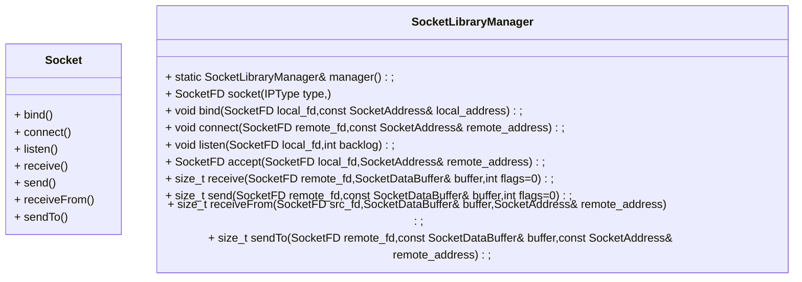

# Improvement Report


## Category

[TOC]

## A brief introductions

The improvement report is mean to report the possible suggestion to improve AntonaStandard, then make it more **efficiency , safety and maintainable** 

Thus, the following contains will describes the improvement suggestions in detail. The suggestions will be divided into pieces by the **versions**  ,so you can easily find the points.

## Before AntonaStandard-v-9.1.0

- The improvements of AntonaStandard-v-9.1.0 are mostly based on the *Effective C++* 

### `Math/Fraction`

- As *Effective C++* **Item 3: Use const whever possible** , the returned value of Fraction `operator` should be declared as `const` , and it would be better to name the arguments as `lhs` and `rhs` to distinguish its position near the operator :

  ```cpp
  const Fraction operator+(const Fraction& lhs,const Fraction& rhs);
  const Fraction operator-(const Fraction& f1,const Fraction& rhs);
  const Fraction operator*(const Fraction& f1,const Fraction& rhs);
  const Fraction operator/(const Fraction& f1,const Fraction& rhs);
  inline const Fraction  operator-();
  // also for member inverse:
  const Fraction inverse()const;
  ```

  

- Using default arguments to fit more forms of usage.

  ```cpp
  Fraction(int num=0,int den=1):numerator(num),denominator(den){};
  ```

- The C++ runtime System can abort the program during division calculation if the denominator is 0, and it's a risk to throw an exception from a constructor.

- As **Item 24: Declare non-member functions when type conversions should apply to all parameters** , we should avoid the friend function whenever we can. So In our project we should cancel the friend declarations and use `getNumerator()` and `getDenominator()` to access the data member. 

- The interface of `alterValue` is not necessary

- moving constructor and moving assignment operator are not necessary


### `MultiplatformSupport::DllSupport`

- The dll handle is a kind of resource ,so using *RAII* to manage it is a better choice.
- However , the DllSupport just provide a low level encapsulation, it's better to provide another class to encapsulate it:  `Utilities::DllLoader` . And we should pay attention to that `unloadDll` may throw an exception to break the destructor, so we should catch this exception and log it then **abort** the program. Of course as the **Item 8: Prevent exceptions from leaving destructors** we should provide an interface `void tryUnload()` for clients so they can do that themselves.


### `MultiplatforSupport::Socket...`

- Put the responsibilitis of managing  `sockaddr_t` memory to smart pointer 

- As **Item 28: Avoid returning "handles" to object internals** , it's risky for the following operations:

  ```cpp
  class SocketAddress{
     void* addr_in = nullptr;			// should be alter to std::shared_ptr<void> addr_in;
  public:
      virtual void* getAddrIn();		// risky! returning "handles" to object internals,alter to virtual std::shared_ptr<void> getAddIn();
      ...
  };
  ```

  ```cpp
  class Socket{
  public:
      using Socketid_t = 
      #ifdef AntonaStandard_PLATFORM_WINDOWS
          SOCKET
      #elif AntonaStandard_PLATFORM_LINUX
          int
      #endif
      ;
  private:
      Socketid_t socketid;
      SocketAddress* address;			// should be alter to shared_ptr<SocketAddress> address;
  public:
      
      inline SocketAddress* getAddress(){
          return this->address;				// risky! should alter to shared_ptr<SocketAddress> getAddress();
      }
      void setAddress(SocketAddress* addr);	// risky too! this interface is used for SocketCommunication::createSocket only (should be private and friend to SocketCommunication)
      inline Socketid_t getSocketId() const{
          return socketid;
      }
      inline void setSocketId(Socketid_t skt_id){	// risky! this interface is used for SocketCommunication::createSocket only, and it is a risk when the client calling it with an invalid skt_id, so it's unwise to explose it to the client (so it should be priavte and friend to SocketCommunication)
          this->socketid = skt_id;
      }
  	Socket();
      Socket(Socket& socket);				// alter to deleted
      Socket(Socket&& socket);			// usable
      ~Socket();
      // it's better to provide swap interfaces
  };
  ```

- For `Socket` we should consider the behaviours of copy constructor and moving constructor. Should the ownership of  `socket_id` should be owned by more than one `Socket` instance?  Of course not. So the **copy constructor and assignment operator should be deleted** .But the moving constructor can be reserved.
- `Socket` should guarantee the socket_id is released when its instance is destructed.

- We should guarantee there is only one instance of `SocketCommunication` , to make our program more efficiency. So the alternative way is using local static object:

  ```cpp
  class SocketCommunication{
  private:
      SocketCommunication();
  public:
      static SocketCommunication& get();				// get the local static instance of SocketCommunication.
      /*
      {
          static SocketCommunication sc;
          return sc;
      }
      */
      // copy constructor of SocketCommunication should be deleted!
      ~SocketCommunication();
      Socket createSocket(SocketProtocol prot,
          SocketType type,unsigned short port,
          const char* addr_str,int defualt=0);        
      Socket createSocket(SocketProtocol prot,
          SocketType type,unsigned short port,
          const std::string addr_str,int defualt=0);   
      void bindSocket(Socket& socket);        
      void listenSocket(Socket& socket);     
      Socket acceptSocket(Socket& socket);    
      void connectSocket(Socket& socket);     
      void closeSocket(Socket& socket);       
  
      void send(Socket& socket,SocketDataBuffer& data);         
      size_t receive(Socket& socket,SocketDataBuffer& data);      
  };
  ```

  

### `ThreadTools::ThreadsPool`

- Before detaching of joining a thread ,it is a must to call `joinable` to judge if the thread is available

- However, the implement of current thread pool is poor , so I decided to alter the existed Thread Pool project then make it available in AntonaStandard:

  https://github.com/lujiawei922/thread-pool.git  
  
  

## Before AntonaStandard-v-10.0.1

### `MultiPlatformSupport::SocketSupport::`

- The following map is the framework of `SocketSupport` so far:

  - **Socket Address :**

  ```mermaid
  classDiagram
  class SocketAddress{
      # std::shared_ptr<void> addr_in;      
      +virtual std::shared_ptr<void> getAddrIn();
      +virtual size_t getAddrInSize()=0;
      +virtual void setAddr(const char* ip,unsigned short port)=0;
      +virtual std::string getIp()=0;
      +virtual unsigned short getPort()=0;
      +virtual SocketProtocol getProtocol()=0;
      +virtual std::shared_ptr<SocketAddress> copy()=0;
  }
  class SocketAddressV4{
      override size_t getAddrInSize();
      override void setAddr(const char* ip,unsigned short port);
      override std::string getIp();
      override unsigned short getPort();
      override SocketProtocol getProtocol();
      override std::shared_ptr<SocketAddress> copy();
  }
  class SocketAddressV6{
  	override size_t getAddrInSize();
      override void setAddr(const char* ip,unsigned short port);
      override std::string getIp();
      override unsigned short getPort();
      override SocketProtocol getProtocol();
      override std::shared_ptr<SocketAddress> copy();
  }
  SocketAddressV6 --|> SocketAddress
  SocketAddressV4 --|> SocketAddress
  ```

  - **Socket: **  

    ```mermaid
    classDiagram
    class Socket{
        - Socketid_t socketid = INVALID_SOCKET;
        - std::shared_ptr~SocketAddress~ address;
        - SocketType type=SocketType::INVALID;
        - Socket();
        - void setAddress(std::shared_ptr<SocketAddress> addr);
        - inline void setSocketId(Socketid_t skt_id);
        + inline std::shared_ptr~SocketAddress~ getAddress();
        + inline SocketType getType();
        + inline Socketid_t getSocketId() const;
        + void swap(Socket& rhs);
        + bool closable()const;
        + Socket(Socket& socket)=delete;
        + Socket& operator=(Socket& socket)=delete;
        + Socket& operator=(Socket&& socket);
        + Socket(Socket&& socket);
        + ~Socket();
    }
    ```

    - 需求分析：
      - `SocketDataBuffer` 的自动增长需求（保留）
      - `Socket` 对象无法复制，这样并不方便使用容器对套接字进行管理，因此建议将 `SocketCommunication::createSocket` 的返回值修改为 `Socket` 的智能指针。这样用户唯一可以获得`Socket` 的实例的形式只能是它的智能指针，同时还解决了共享对象的问题。故这样也没有必要保留 `Socket` 的swap语义，因为智能指针的swap语义完全可以覆盖需求。
      - 将 `SocketCommunication` 操作套接字的接口封装到 `Socket` 内部，原因是为了避免`Socket`的智能指针携带空指针而带来的维护成本。
      - 是否有必要用工厂？或者说我们是否对套接字类的多态需求是否要求很高？
        - 这将决定我们如何设计接口
        - 套接字的多态会用在什么地方
          - 某个服务器程序需要管理若干个客户端连接，其中可能有UDP连接（算不上连接，但是这个逻辑关系可以假设），TCP 连接（ipv4，ipv6）,表示这些连接的套接字被存放在一个容器中，该服务器程序有遍历这些容器，统一发送数据的需求
          - 一个服务器程序被允许以同一套代码接收和处理各种不同协议的客户端的连接：
            - 这需要我们统一接收和发送数据的接口
        - 工厂确实没有必要，因为套接字的派生类型并不是太多。但是我们仍然需要一种手段限制用户获得的套接字实例的形式为智能指针
      - 用户不会直接操作客户端套接字，因此派生 `Socket` 没有必要派生成`ServerSocket` 和 `ClientSocket` ，而是派生成`TCPSocket` 和 `UDPSocket` 。不过客户端和服务端操作套接字仍然是有区别的。可以将这些操作封装到一个统一的接口 `init` 中，这样既可以保证用户在创建一个套接字可以使用统一的接口实现这些操作，也可以
      - 服务端套接字和客户端套接字不尽相同，为了避免用户用错套接字，基于 `Socket` 进一步派生出 `ServerSocket` 和 `ClientSocket` ，而原来的 `Socket` 只作为接口存在，保留所有操作套接字的接口，但是假如对一个 `ServerSocket` 进行与客户端套接字有关的操作时，由于该接口被重写会抛出异常（比如调用 `ServerSocket::connectSocket` 会抛出异常）
      - UDP 和 TCP 的套接字也不尽相同，如果在 `ServerSocket` 和 `ClientSocket` 的基础上继续派生反而增大了耦合度。根据总结 UDP 套接字在客户端（发送方）和服务端（接收方）上的操作基本相同，因此可以直接在 `Socket` 的基础上派生
      - - -
    - 重新定义 `AntonaStandard` 的设计美学：
      - **小而美** ：每个模块之间不应该有耦合，用户可以将某个模块单独拿出来使用
        - 目前项目中存在耦合的地方是异常类。应当将这些单独的异常类存放到每个模块自己的文件中


- `SocketAddress` :

  - 摒弃派生 `SocketAddressV4` 和 `SocketAddreessV6` 的方案，直接判断其内部保存的是 `sockaddr_in` 还是 `sockaddr_in6` 。

  - 其他接口

    - `getAddrIn()` : 返回 `sockaddr_t` 的智能指针，传递给底层接口 
    - `getAddrInSize()` : 返回 `sockaddr_t` 对应的对象的大小，用于判断 `sockaddr_t` 指针指向的是 `sockaddr_in` 还是 `sockaddr_in6` 
    - `getIp()` : 返回包含的地址的 IP 字符串
    - `getPort()` : 返回对应的端口号

  - 构造函数

    - 接受 `ip` 字符串
    - 接受端口
    - 接受 `IPType` 枚举，用于决定生产的地址类型是 v 4 还是 v 6

  - 其它静态函数（调用工厂实现）

    - 生产本地回环地址的静态函数

      生产本地主机地址的静态函数

- `Socket` 基类，接口类

  - `receiveFrom`   ： 底层调用`recvfrom` 实现

    - `SocketAddress` 

    - `DataBuffer` 

      ```cpp
      local.receiveFrom(addr,buf);				// 从addr 接收数据，数据存储在buf中
      ```

  - `sendTo`  : 底层调用 `sendto` 实现

    - `SocketAddress`  

    - `DataBuffer` 

      ```cpp
      local.sendTo(addr,buf);						// 向addr 发送数据，数据存储在buf中
      ```

  - `getAddress` : 返回当前套接字的地址（常引用）

  - `close` 

    - 关闭套接字

  - 构造办法

    - 接受 `SocketAddress` 对象
    - 接受 `ProtocolType` ,可以构造出适用于TCP 和 UDP 的套接字（由它的派生类构造）

- `RemoteSocket` : TCP客户端使用，用于表示目标主机的套接字

  - `connect` : 连接到目标主机 

- `LocalSocket` : TCP服务端使用，用于表示本地主机的套接字

  - `bind` : （创建时调用，绑定到本地地址）
    - 无参数
  - `listen` : 设置监听
    - 无参数
  - `accept`  : 接收远端的连接，返回地址而不创建远端的套接字对象，不过远端套接字的描述符`fd` 会由`LocalSocket` 维护，保证正确释放 
    - 无参数
  - `receive` : 基于`LocalSocket` 维护的远端套接字描述符，调用 `recv` 实现数据接收
    - `SocketDataBuffer` 
  - `send` : 基于 `LocalSocket` 维护的远端套接字描述符，调用 `send` 实现数据接收
    - `SocketDataBuffer` 
  - 同时也支持 `reveiveFrom` 和 `sendTo` 接口

- `DatagramSocket` : UDP 服务端和客户端使用

  - ```cpp
    server.receiveFrom(addr,buf);					// addr为空，只要接收到了发送端的数据就会将地址写入addr
    server.sendTo(addr,buf);
    ```
    
    

- 把Socket的创建权限还给对应的类，这样更加灵活。这要需要保证移动语义和swap语义

- 将地址和


- 推演
- **基本业务推演** 

```cpp
// 客户端
TCP::RemoteSocket remoteSock(SocketAddress(SocketAddress::IPType::ipv4,8888,"127.0.0.1"));

remoteSock.connect();
// 连接成功
SocketDataBuffer buf;

remoteSock.receive(buf);
// 读数据，写数据等操作
remoteSock.send(buf);

remoteSock.receiveFrom(remoteSock.address(),buf);
remoteSock.sendTo(remoteSock.address(),buf);

// 服务端
TCP::LocalSocket localSock(SocketAddress::loopBackAddress(IPType::ipv4,8888));
localSock.listen();
SocketAddress remote_address = localSock.accept();

localSock.receive(buf);
localSock.send(buf);

localSock.sendTo(remote_address,buf);
localSock.receiveFrom(remote_address,buf);
```

```cpp
// UDP 客户端
UDP::RemoteSocket remote_socket(SocketAddress(SocketAddress::IPType::ipv4,8888,"127.0.0.1"));

SocketAddress remote_address;
remote_socket.receiveFrom(remote_address,buf);

remote_socket.sendTo(remote_address,buf);

// UDP 服务端

UDP::LocalSocket
local_socket(SocketAddress::loopBackAddress(IPType::ipv4),8888);

// 收发
SocketAddress remote_address;
local_socket.receiveFrom(remote_address,buf);

local_socekt.sendTo(remote_address,buf);
```

- **构造推演**

  - `SocketAddress` 推演

    ```c++
    SocketAddress(IPType ip_type,unsigned short port,string addr){
        switch(ip_type){
            case ipv4:
                this->addr_in = std::make_shared<sockaddr_in>();
                // 首先将addr_in进行转换，方便操作
                sockaddr_in* this_addr_in = (sockaddr_in*)this->addr_in.get();
                // 设置协议 ipv4
                this_addr_in->sin_family = SocketProtocol::ipv4;
                // 设置ip
                this_addr_in->sin_addr.s_addr = inet_addr(ip);
                // 设置端口
                this_addr_in->sin_port = htons(port);
                break;
            case ipv6:
                this->addr_in = std::make_shared<sockaddr_in6>();
                // 首先转化addr_in，方便操作
                sockaddr_in6* this_addr_in = (sockaddr_in6*)this->addr_in.get();
                // 设置协议
                this_addr_in->sin6_family = SocketProtocol::ipv6;
                // 设置ip
                inet_pton(ip_type,ip,&(this_addr_in->sin6_addr));
                // 设置端口
                this_addr_in->sin6_port = htons(port);
                break;
            default:
                break;
        }
    }
    
    SocketAddress SocketAddress::loopBackAddress(IPType ip_type,unsigned short port){
        switch(ip_type){
            case ipv4:
                return SocketAddress(ip_type,port,"127.0.0.1");
            case ipv6:
                return SocketAddress(ip_type,port,"::1");
            default:
                return SocketAddress();
        }
    }
    
    
    ```

    




