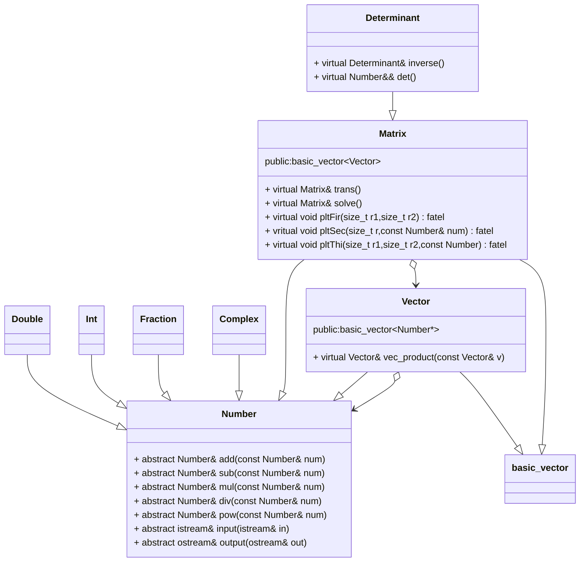

# Numbers数字与运算库

## 目录

[toc]

## 项目版本

| 版本号 | 版本描述 | 时间 |
| ------ | -------- | ---- |
|        |          |      |

## 项目目的

- 对基本数据类型进行面向对象分装，并结合派生体系允许多态存储与扩展

## 项目原理

- 派生体系的引用和指针协变
- 基于派生体系的运算符重载

## 项目结构

- 交互设计：
  - 隐式转换表

|   convert to    | Int  | Double | Fraction | Complex | Vector | Matrix | Determinant |
| :-------------: | :--: | :----: | :------: | :-----: | :----: | :----: | :---------: |
|     **Int**     |  T   |   T    |    T     |    T    |   T    |   T    |      T      |
|   **Double**    |      |   T    |    T     |    T    |   T    |   T    |      T      |
|  **Fraction**   |      |        |    T     |    T    |   T    |   T    |      T      |
|   **Complex**   |      |        |          |    T    |   T    |   T    |      T      |
|   **Vector**    |      |        |          |         |   T    |   T    |             |
|   **Matrix**    |      |        |          |         |        |   T    |      T      |
| **Determinant** |      |        |          |         |        |        |      T      |

- ​	
  - 隐式转换说明：允许小到大的隐式转换，实现方式是在目标大对象中添加相关的构造函数

---

- 
  - 强制类型转换表

|   convert to    | Int  | Double | Fraction | Complex | Vector | Matrix | Determinant |
| :-------------: | :--: | :----: | :------: | :-----: | :----: | :----: | :---------: |
|     **Int**     |      |        |          |         |        |        |             |
|   **Double**    |  T   |        |          |         |        |        |             |
|  **Fraction**   |  T   |   T    |          |         |        |        |             |
|   **Complex**   |      |        |          |         |        |        |             |
|   **Vector**    |      |        |          |         |        |        |             |
|   **Matrix**    |      |        |          |         |        |        |             |
| **Determinant** |      |        |          |         |        |        |             |

- 
  - 强制类型转换说明：允许某些大到小的强制类型转换，实现方式是重载运算符 operator Name() operator Name*()

- 运算：基于运算符重载
  - 重载运算符通过调用运算虚函数来实现功能
