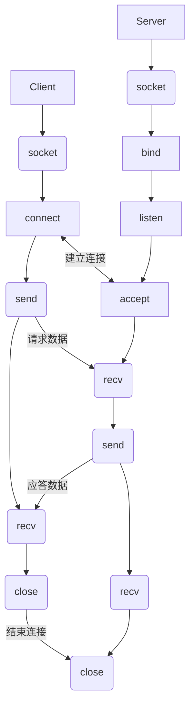

# SocketSupport 多平台套接字库支持

## 目录

[toc]

## 项目版本

| 版本号  | 版本说明                                          | 时间      |
| ------- | ------------------------------------------------- | --------- |
| v-0.0.0 | 实现套接字的跨平台封装，支持IPV4的TCP通信         | 2023/9/15 |
| v-1.0.0 | 重新多态封装IP地址与端口，支持IPV4和IPV6的TCP通信 | 2023/9/16 |

## 版本计划

| 版本号  | 版本说明                                    |
| ------- | ------------------------------------------- |
| v-0.0.0 | 实现套接字的跨平台封装，支持IPV4的TCP通信   |
| v-1.0.0 | 将ip地址结构单独封装，使得支持IPV6的TCP通信 |
| v-2.0.0 | 提供对UDP同行的支持                         |


## 项目目的

- 对 Windows 平台和 Linux 平台的套接字库进行简单的封装，使得可以使用完全一样的接口在Windows 和 Linux 平台上使用套接字库

## 套接字通信流程



- 一个套接字只能处理一个连接

## Windows平台与Linux平台套接字库对比

### 接口对比

| 功能                                                   | Windows                                                      | Linux                                                        | 差别                                                         |
| ------------------------------------------------------ | ------------------------------------------------------------ | ------------------------------------------------------------ | ------------------------------------------------------------ |
| 创建套接字                                             | `SOCKET socket(int af, int type, int protocol)`              | `int socket(int __domain, int __type, int __protocol)`       | 返回值，Windows 平台的返回值本质是 `__int64` ,虽然都是整型，但是windows平台的更大 |
| 服务端套接字绑定本地ip和端口                           | `int __stdcall bind(SOCKET s, const sockaddr *name, int namelen)` | `int bind(int sockfd, const struct sockaddr *addr, socklen_t addrlen)` | 没有区别                                                     |
| 服务端启动监听                                         | `int __stdcall listen(SOCKET s, int backlog)`                | `int listen(int sockfd, int backlog)`                        | 除了套接字描述符大小不同，其它完全一样                       |
| 客户端请求连接服务器                                   | `int connect(SOCKET s, const sockaddr *name, int namelen)`   | `int connect(int __fd, const struct sockaddr *__addr, socklen_t __len)` | 除了套接字描述符的大小，第二个参数是包含协议类型，ip地址，以及端口号的字节序，第三个参数描述字节序的长度，Windows下是int,Linux 是无符号int |
| 服务端接受客户端的连接请求,并返回接收的客户端套接字    | `SOCKET __stdcall accept(SOCKET s, sockaddr *addr, int *addrlen)` | `int accept(int sockfd, struct sockaddr *addr, socklen_t *addrlen)` | 套接字大小不同，描述字节序长度的类型不同                     |
| 向指定套接字数据发送（**字节序**）                     | `int __stdcall send(SOCKET s, const char *buf, int len, int flags)` | `ssize_t send(int __fd, const void *__buf, size_t __n, int __flags)` | 基本相同                                                     |
| 关闭套接字                                             | `int __stdcall closesocket(SOCKET s)`                        | `int close(int __fd)`                                        | 接口名称不同，参数相同                                       |
| 数据接收(**字节序**)，返回接收到的                     | `int recv(SOCKET s, char *buf, int len, int flags)`          | `ssize_t recv(int sockfd, void *buf, size_t len, int flags)` | Linux下不会限制数据节后的缓存的类型，Windows默认为字节序，另外描述返回的数据长度时，Windows下默认用`int` 接收，Linux ssize_t 在64位机上表示8个字节，类型是`long int` |
| 16位**主机字节序**（小端）转16位**网络字节序**（大端） | `u_short htons (u_short hostshort )`                         | `uint16_t htons(uint16_t hostshort)`                         | 没有区别                                                     |
| 16位**网络字节序**（大端）转16位**主机字节序**（小端） | `u_short ntohs (u_short netshort )`                          | `uint16_t ntohs(uint16_t netshort)`                          | 没有区别                                                     |
| 32位**主机字节序**（小端）转32位**网络字节序**（大端） | `u_long htonl ( u_long hostlong)`                            | `uint32_t htonl(uint32_t hostlong)`                          | 没有区别                                                     |
| 32位**网络字节序**（大端）转32位**主机字节序**（小端） | `u_long ntohl ( u_long netlong)`                             | ` uint32_t ntohl(uint32_t netlong)`                          | 没有区别                                                     |
| ipv4，ipv6 二进制字节序转十进制字符串(窄字符)          | `LPCSTR inet_ntop(INT Family, LPCVOID pAddr, LPSTR pStringBuf, size_t StringBufSize)` | `const char *inet_ntop(int af, const void *src,char *dst, socklen_t size);` | 没有区别,`LPCVOID` 是`const void*` 的别名`LPSTR` 是`char*`  的别名 |
| ipv4，ipv6 十进制字符串转二进制字节序（窄字符）        | `INT inet_pton(INT Family, LPCSTR pStringBuf, PVOID pAddr)`  | `int inet_pton(int af, const char *src, void *dst);`         | 没有区别                                                     |
| ipv4点分十进制转**大端** 整型                          | `unsigned long inet_addr (const char* cp)`                   | `in_addr_t inet_addr (const char *cp)`                       | 没有区别                                                     |

### 数据结构对比

| 功能                                                         | Windows                                             | Linux          | 差别                                                         |
| ------------------------------------------------------------ | --------------------------------------------------- | -------------- | ------------------------------------------------------------ |
| 存储当前主机的ip 和 端口信息                                 | `sockaddr` 或 `SOCKADDR` 同一结构体的不同别名       | `sockaddr`     | 没有区别                                                     |
| 用于向socketaddr写入ipv4数据的数据结构，因为socketaddr中的数据字段（ip 和端口是连续存储的，不方便写入数据） | `sockaddr_in` 或 `SOCKADDR_IN` 同一结构体的不同别名 | `sockaddr_in`  | 没有区别                                                     |
| 用于向socketaddr写入ipv6数据的数据结构，因为socketaddr中的数据字段（ip 和端口是连续存储的，不方便写入数据） | `sockaddr_in6`                                      | `sockaddr_in6` | 没有区别                                                     |
| 存储ip地址                                                   | `addr_in`                                           | `addr_in`      | 内容有所差别，一般设置地址时不会直接访问这个结构体，可以忽略这些差异 |


- 另外Windows 平台的套接字库不是默认链接的，一般需要手动链接，对于MSVC来说可以在文件内使用下面的宏告诉编译器需要链接

  ```cpp
  #pregma comment(lib,"ws2_32.lib")			// 链接静态库
  #pregma comment(dll,"ws2_32.dll")			// 链接动态库
  ```

- MinGW 中是不支持这个指令的，另外静态库的后缀也不同，因为本项目需要跨平台，最好的解决方案是在cmake中处理这个操作

  ```cmake
  # 当平台是Windows平台时链接这个库
  link_libraries(libws2_32.a)						# 静态库
  
  # 或者对一个ELF文件mytarget进行链接
  target_link_libraries(mytarget libws2_32.dll)	# 动态库
  target_link_libraries(mytarget libws2_32.a)		# 静态库
  ```


- ==另外本项目暂时还未解决:  提前将Windows 套接字库链接到项目库文件的技术，使得第三方可以不用手动链接套接字库的技术。因此当你的项目中使用了本项目，请手动连接Windows套接字库==  

- 另外Windows平台下的套接字需要进行加载，然后在使用结束后释放掉

  - 启动流程（[WSAStartup 函数 (winsock2.h) - Win32 apps | Microsoft Learn](https://learn.microsoft.com/zh-cn/windows/win32/api/winsock2/nf-winsock2-wsastartup)） 

  ```cpp
  WORD wVersionRequested;						// 存储套接字版本，Windows下的套接字库是支持版本指定的，当前的最新版本是2.2
  WSADATA wsaData;							// 用于存储启动的套接字的相关信息，大致包含套接字库版本，可创建的最大套接字数量，数据报消息大小等，本项目中暂时用不到，封装时可以忽略。
  int err;
  
  /* Use the MAKEWORD(lowbyte, highbyte) macro declared in Windef.h */
  wVersionRequested = MAKEWORD(2, 2);			// 指定套接字版本位2.2
  
  err = WSAStartup(wVersionRequested, &wsaData);
  if (err != 0) {
      /* Tell the user that we could not find a usable */
      /* Winsock DLL.                                  */
      printf("WSAStartup failed with error: %d\n", err);
      return 1;
  }
  ```

  - 关闭流程（[WSACleanup 函数 (winsock.h) - Win32 apps | Microsoft Learn](https://learn.microsoft.com/zh-cn/windows/win32/api/winsock/nf-winsock-wsacleanup)）

  ```cpp
  // 每调用一次wsaData,当它不需要再使用时就需要调应下面的函数
  WSACleanup();
  ```

  

## 封装策略

- 只进行**较低限度** 的封装(**只涉及套接字的封装，不涉及服务端和客户端代码的封装**)，因为本项目主要是为其它项目提供跨平台支持，不宜过于复杂，要保证 `Linux` 端和 `Windows` 端的流程完全相同 
- 需要封装的数据
  - 套接字协议类型枚举 `SocketProtocol` 
    - `ipv6` ：ipv6 协议
    - `ipv4` ：ipv4 协议

  - 套接字协议实现类型 `SocketType` 
    - `Stream` : 流式传输协议，其对应的默认类型为 TCP
    - `Dgram` : 报文传输协议，其对应的默认类型为 UDP

  - 套接字IP地址和端口封装到抽象类 `SocketAddress` 
    - 原生的 `sockaddr` 需要使用 `sockaddr_in` 和 `sockaddr_in6` 来写入数据，然后进行指针类型转换，用起来比较麻烦，因此使用 `SocketAddress` 封装 `sockaddr` 
    - 提供功能：
      - 存储端口
      - 获取端口
      - 存储ip地址
      - 获取ip地址
      - 存储`sockaddr_in` (1pv4) 或者 `sockaddr_in6` (1pv6) 
      - 设置地址：兼容ipv4和ipv6
      - 获取协议
    - 派生类 （具体实现基类提供的功能接口）
      - `SocketAddressV4` 通过 `void*` 指针存储 `sockaddr_in` 结构
      - `SocketAddressV6` 通过 `void*` 指针存储 `sockaddr_in6` 结构
  - 套接字，封装到类 `Socket` ：
    - 因为`Windows`端和`Linux`端的套接字类型不相同，可以封装到一个类`Socket`，需要使用条件编译
    - 套接字往往和地址同时使用，所以 `Socket` 内部会保存一个 `SocketAddress` 指针，根据`SocketCommunication::createSocket` 的参数来决定实例化 `SocketAddressV4` 还是 `SocketAddressV6` 对象
  - 传输和接收数据的容器：`SocketDataBuffer` 
    - 该类派生自 `stringbuf` ,可以供标准库的流对象 **写入** 和 **读取** 

- 需要封装的接口
  - 接口可以封装到一个类 `SocketCommunication`  
    - 构造函数中完成对 `Windows` 平台下套接字库的加载，`Linux` 平台可以设置为空
    - 析构函数中完成对 `Windows` 平台下套接字库的释放，`Linux` 平台可以设置为空
    - (**服务端**)将套接字绑定到本地端口 
      - 地址以及协议会保存到套接字类的指针中
    - (**服务端**)设置监听 
    - (**服务端**)接受客户端的连接 
    - (**客户端**)发出向服务端的连接请求 
    - 发送数据: 使用缓冲区对象 `SocketDataBuffer` 
    - 接收数据: 使用缓冲区对象 `SocketDataBuffer` 

## 注意事项

- 客户端在发完数据后需要设置休眠等待服务端响应，否则可能造成连接的问题
- 请注意端口的分配问题，如果端口号偏小，可能会**绑定**错误。(Windows 套接字错误码 10049)
- 如果在Windows平台调用本项目出现符号未定义的错误，请手动链接 `ws2_32` 库。