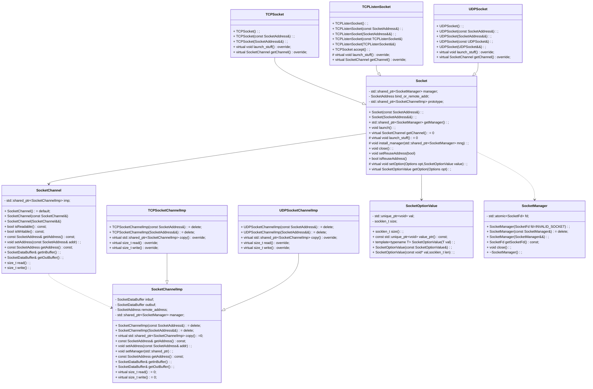

## 说明

- 该模块是基于 `CPS` 的低层次套接字封装接口进一步实现的高层次套接字封装。目的在于进一步简化套接字的使用


## 设计

**仿照Java的套接字库设计，为了保证异常安全，将Java中可能在构造函数中抛出异常的操作从构造函数中抽离出来** 


### 顶层接口使用设计


#### TCP相关

- 客户端

```cpp
using namespace AntonaStandard;
// 创建一个目标地址为 192.168.1.109:8000 的套接字
Network::Socket sock(SocketAddress("192.168.1.109",8000));

// 启动套接字,该函数只会调用一次（基于std::call_once 线程安全）,该函数的功能委托给了虚函数launch_stuff()，该函数可能抛出异常
sock.lanuch();

// 获取通道对象
SocketChannel channel = sock.getChannel();

// 通过通道对象获取输出流缓冲,用于发送
std::ostream outs(channel.getOutBuffer());

// 向输入缓冲区写入数据
outs<<"hello world"<<std::endl;

// 发送，发送后会自动清空缓冲区
size_t sended = channel.write();

// 获取输入缓冲区，用于接收
std::istream ins(channel.getInBuffer());

// 接收数据,数据将写入到InBuffer中，线程不安全，读取后不会自动清除缓冲区
size_t received = channel.read();

// 读取(使用方式与cout,cin类似)
std::string line;
std::getline(ins,line);
```

- 服务端

```cpp
using namespace AntonaStandard;
// 创建一个监听套接字
Network::TCPListenSocket lissock(SocketAddress::anyAddress(8000,ipv4));

// 启动前可以设置端口复用
lissock.setReuseAddress(true);

// 可以查看是否启用了端口复用
lissock.isReuseAddress();

// 启动套接字，该操作中包含绑定和监听步骤，且该函数可能抛出异常
lissock.launch();		

// 等待客户端连接
Network::TCPSocket sock = lissock.accept();

// 连接成功，通过channel查看远端地址和端口，对于TCP来说，其channel是单例
SocketChannel channel = sock.getChannel();
channel.getAddress().getIP();
channel.getAddress().getPort();

// 获取输出缓冲区，用于发送
std::ostream outs(sock.getChannel().getOutBuffer());

// 向输入缓冲区发送写入数据
outs<<"hello world"<<std::endl;

// 发送
size_t sended = sock.write();

// 获取输入缓冲区，用于接收
std::istream ins(sock.getChannel().getInBuffer());

// 接收数据,数据将写入到InBuffer中，线程不安全
size_t received = sock.read();

// 读取(使用方式与cout,cin类似)
std::string line;
std::getline(ins,line);

// 关闭套接字
lissock.close();
sock.close();
```

---


#### UDP相关

- 客户端（服务端）

```cpp
using namespace AntonaStandard;
// 创建UDP套接字，并设置需要绑定的地址
Network::UDPSocket sock(SocketAddress::anyAddress(9000,ipv4));			
// 启动套接字
sock.launch();

// UDP可以有多个通道（故与TCP不同，它的通道对象不是单例），这使得它可以进行广播
SocketChannel channel_1 = sock.getChannel();
SocketChannel channel_2 = sock.getChannel();

channel_1.setAddress(SocketAddress("192.168.1.109"),9000);
// channel_1 已经具有目标地址和端口，可以进行读和写

// channel_2 没有设置目标地址和端口，只能进行读
channel_2.read();

//如果有其它主机通过该UDP套接字连接到了该主机，read()调用结束后，channel的目标地址便有了值,然后就可以进行写操作
channel_2.getAddress().getIP();
channel_2.getAddress().getPort();

// 获取读缓冲
std::istream ins(sock.getInBuffer());
// 操作读缓冲
// 获取写缓冲
std::ostream outs(sock.getInBuffer());
// 关闭套接字
sock.close();

```


### 架构设计




- `SocketChannel` : 负责TCP或UDP的通信工作，由所属的套接字对象的 `getChannel()` 创建，通过一个 `std::shared_ptr` 指针与其所属的套接字对象的管理器 `SocketManager` 建立联系。另外为了使用起来更加方便，使用 `pimp` 策略 对 `SocketChannel` 的具体实现进行了隐藏，比如：TCP通信是面向连接的，一个套接字只能处理一个通信，因此通过TCP套接字获得的 `SocketChannel` 是一个单例，UDP通信是无连接的，一个套接字可以处理多端的通信，因此通过UDP套接字获得的 `SocketChannel` 是可深拷贝的。具体的实现由 `SocketChannelImp` 的子类完成。
  - `SocketChannelImp` 的子类通过重写 `copy()` 决定是深拷贝还是浅拷贝。`SocketChannel` 的成员 `imp` 存储的是指向 `SocketChannelImp` 的子类的共享指针，在调用 `SocketChannel` 的拷贝构造函数时它会调用对应`SocketChannelImp` 子类的 `copy()` 完成`imp` 的拷贝工作
  - `SocketChannel` 中会存储管理用于通信的目标地址`SocketAddress` 
  - `SocketChannel` 为客户端提供了接口 `isReadable()` 和接口 `isWritable()` 来判断该通道是否可读和可写。判断可读则会判断 `manager` 指针和 `imp` 指针是否为空。可写还会判断 `imp` 的 `remote_addr` 成员的指向 `SocketAddressImp` 的指针是否为空。
  - `SocketChannel` 是允许拷贝构造的，其拷贝构造会调用对应 `imp` 的`copy` 函数
- `Socket` 负责套接字文件描述符的管理工作，包含各种启动操作（绑定，连接）等。同时可以生产`SocketChannel` 进行通信。由于`Socket` 的生命周期有可能和`SocketChannel` 不同，为了防止使用 `SocketChannel` 时出现悬空引用（即 `Socket` 对象已经释放，对应的套接字文件描述符被关闭），故其内部不直接维护套接字文件描述符，而是维护一个指向 `SocketManager` 的共享智能指针，套接字文件描述符的关闭工作由 `SocketManager` 来管理
  - `Socket` 和它的子类使用了单例模式，允许拷贝构造和赋值运算
  - `Socket` 构造函数可以接收一个 `SocketAddress` 对象，用于指定监听的地址和端口（给UDP套接字 `UDPSocket` 和TCP监听套接字 `TCPListenSocket` 使用）。TCP 通信套接字 `TCPSocket` 中该地址与`SocketChannel` 中存储的通信目标地址是相同的。
  - 它的子类会具体实现TCP通信套接字，TCP监听套接字，UDP套接字的功能
  - 它的子类会重写`getChannel()` 函数，用于创建对应功能的套接字通道。即为`SocketChannel` 安装对应功能的 `SocketChannelImp` 子类。在`Socket` 构造阶段就会生成一个名为 `prototype` 的`std::shared_ptr<SocketChannelImp>` 成员，`getChannel()` 中安装的都是通过调用它的 `copy()` 函数获得的。 
  - 它的子类会重写 `launch_stuff()` 函数，完成套接字创建，绑定以及连接等操作。比如 `TCPSocket` 中的 `launch_stuff` 函数需要完成套接字管理器创建和套接字文件描述符的连接，`TCPListenSocket` 需要完成套接字管理器的创建和套接字文件描述符的绑定以及监听操作
  - TCP 监听套接字`TCPListenSocket` 是不允许读写的，故在 `TCPListenSocket` 中会禁用`getChannel()` 即调用该函数会抛出异常。
  - 它内部提供了设置套接字选项的接口 `setOption(...)` 和 `getOption(...)` 这二者内部会分别调用 `SocketLibraryManager::setSocketOption(...)` 和`SocketLibraryManager::getSocketOption(...)` ，而 `setReuseAddress()` 和 `isReuseAddress()` 是对它们的进一步封装，用于实现端口和地址复用
- `SocketManager` 基于 `RAII` 理念用于管理套接字文件描述符的创建和销毁。
  - `SocketManager` 是 `Socket` 对象维护的单例，故它禁止拷贝构造和赋值运算
  - `SocketManager` 对象在所属的 `Socket` 对象的`launch_staff` 函数中创建，`launch_staff` 中会调用`CPS::SocketLibraryManager::socket` 函数创建套接字描述符,并通过`SocketManager::setSocketFd(...)` 设置给`SocketManager` 进行管理，而`SocketManager` 对象在所属的 `Socket` 对象的 `close` 函数中会调用 `SocketManager::close` 函数来关闭套接字文件描述符。
  - `CPS::SocketLibraryManager::socket` 和 `CPS::SocketLibraryManager::close`  都有可能抛出异常。这意味着`SocketManager` 的析构函数中可能抛出异常。这样可能导致异常安全问题：析构函数中应当禁止抛出异常，因为这样可能导致未定义错误，但是为了保障在没有异常发生的前提下文件描述符一定能被关闭，`SocketManager` 还是需要调用可能抛出异常的 `CPS::SocketLibraryManager::close` 函数，但是我们对外提供了`close` 成员函数，使得客户端可以自行处理对应的异常。而如果析构函数中有异常抛出，析构函数内部会捕获该异常然后触发程序中断，避免出现未定义错误。
  - 调用 `Socket::Manager::close()` 函数后，其存储套接字文件描述符的成员将被置为 `INVALID_SOCKET` ,这个步骤由原子变量（即存储套接字文件描述符的成员被定义成一个原子变量 `std::atomic<SocketFd>` ）保证线程安全。
- `SocketOptionValue` 类似C++17 和 Boost 内的 `any` 类，它提供了一种无继承多态，用于存储不同类型的套接字选项值。


### 流程设计

#### 创建流程

##### 套接字 `Socket` 及其派生类


##### 套接字管理器 `SocketManager` 


##### 套接字通道 `SocketChannel` 


##### 套接字通道实现类 `SocketChannelImp` 及其子类


#### 通信流程（`Socket` 类的派生类）

##### TCP监听套接字 `TCPListenSocket` 


##### TCP通信套接字 `TCPSocket`


- `TCPSocket` 对象的套接字通道使用的是单例模式


##### UDP通信套接字 `UDPSocket` 


