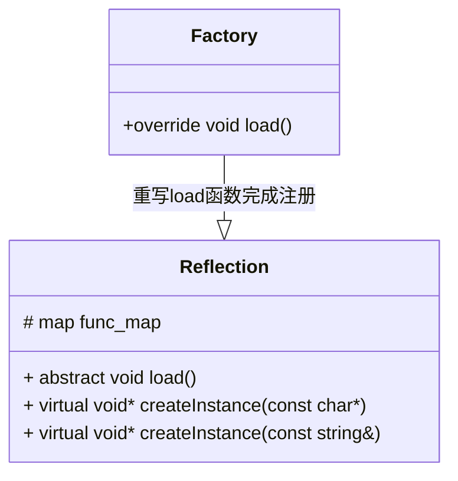

# Reflection 反射

## 目录

[toc]

## 前言


- 反射机制其实就是用来改进简单工厂模式的，简单工厂模式需要编写if else 来建立字符串和类实例之间的映射关系，导致不便扩展和修改
- 由于C++的局限性，无法完成像C#那样自动注册类，我们的项目必须要手动注册
- 我的博客：
  - [(1条消息) 【项目四】C++实现反射机制（通过宏和包装Lambda表达式实现）_学艺不精的Антон的博客-CSDN博客](https://blog.csdn.net/yyy11280335/article/details/128524632?spm=1001.2014.3001.5502) 

## 项目版本

| 版本号  | 版本描述                                                     | 时间     |
| ------- | ------------------------------------------------------------ | -------- |
| v-1.0.0 | 初步实现反射机制                                             | 2023/1/2 |
| v-1.2.0 | 添加宏REGISTER_BY_OTHERNAME,允许自定义注册名称               | 2023/7/8 |
| v-1.3.0 | 修改命名空间从 `AntonaStandard` 到 `AntonaStandard::Utilities` | 2023/8/8 |


## 项目原理

- 我们想要实现的是通过字符串查找对应的类型，然后构造出这样一个实例对象
  - 通过宏的特殊关键字#来将用户注册的类名转化成字符串
  - 由于构造函数没有办法显式调用，对于每一个类都需要声明一个函数用于回调构造
    - 避免重复编写这个声明，使用宏来进行替换声明
- 声明一个抽象类，在其派生类中重写纯虚函数load()在内部通过上面的宏进行注册，这样可以依靠多态来实现反射的可扩展性。
  - 由于函数不能在其它函数内定义，而宏只是简单的进行代码替换，因此为了能在纯虚函数中使用宏定义这样一个函数，可以想到的是使用lambda表达式。

## 项目结构



## 相关演示

- 首先声明两个测试类

```cpp
class A{
public:
    A(){
        cout<<"A构造了"<<endl;
    };
};
class B{
public:
    B(){
        cout<<"B构造了"<<endl;
    };
};
```

- 派生反射类

```cpp
class Factory:public Reflection{
public:
    Factory():Reflection(){this->load();};
    virtual void load()override{
        INIT;							// 初始化声明零时变量的宏
        REGISTER(A);					// 注册类A
        REGISTER(B);					// 注册类B
    }
};
```

- 通过字符串获取类的新实例对象

```cpp
int main(){
    Factory fac;							// 实例化派生的反射类（其实是一种广义的简单工厂）
    A* a  = (A*)fac.createInstance("A");	// 创建A的实例，注意需要对返回值类型进行强制转换
    B* b = (B*)fac.createInstance("B");
    fac.createInstance("C");				// 由于类C未被注册，因此会抛出异常
/* 输出
A构造了
B构造了
terminate called after throwing an instance of 'AntonaStandard::NotFound_Error'
  what():  The type you create was not registered!: C
*/
}
```


